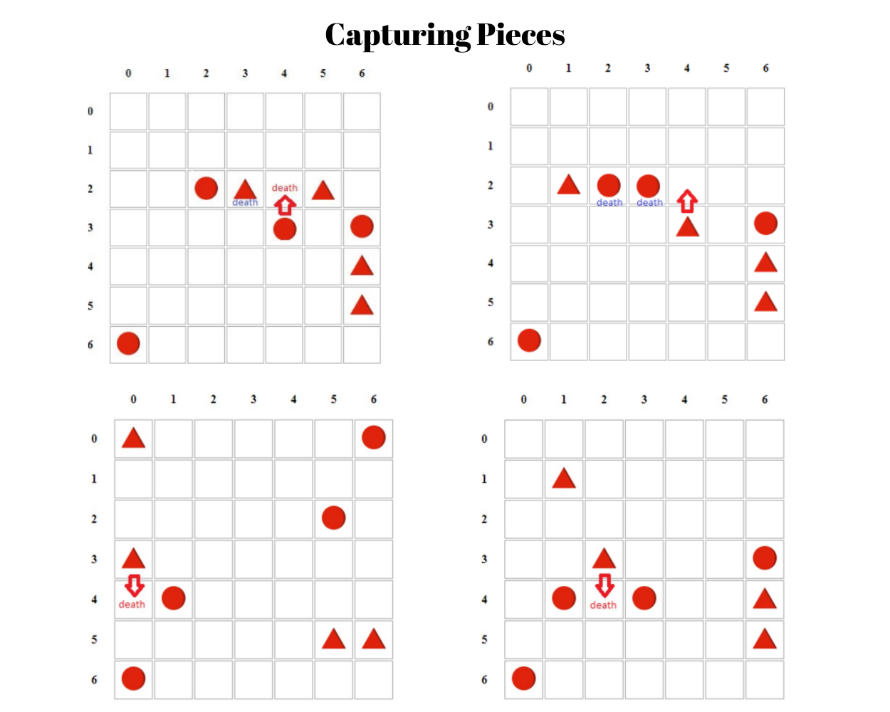

# Strategic Board Game

This project implements an AI-based strategic board game for the course **CSE462 - Fall 2024** at **Yeditepe University, Department of Computer Engineering**.

## Description

The strategic board game is a turn-based game where Player 1 (AI) competes against Player 2 (Human). The AI employs advanced algorithms like Minimax with Alpha-Beta Pruning for decision-making. The game features a clean user interface with a 7x7 board and various configurations, along with sound effects and game rules integrated within the interface.

## Demo

[](demo.png)

- Live Demo: [Strategic Board Game](469-term.vercel.app)

## Features

### Game Rules

[](rules.png)

1. The board size is 7x7.
2. Player 1 (AI) uses triangle-shaped pieces.
3. Player 2 (Human) uses circle-shaped pieces.
4. Both players start with 4 pieces placed on the board.
5. Players can move pieces horizontally or vertically but not diagonally.
6. Capturing pieces occurs under the following conditions:
   - A piece or group of pieces is sandwiched between two opponent pieces or between a wall and an opponent piece.

- **Summary**: The game board size is 7x7. The triangle symbols are the pieces belonging to Player 1, who is AI-based. The circle symbols are the pieces belonging to Player 2, the human player. Each player has four pieces. When the game starts, Player 1 makes the first move. Pieces can move both horizontally and vertically. Diagonal movements are not allowed. If a player has more than one piece, they must make two consecutive moves with different pieces. If a player has only one piece, they can make only a single move.

### Game End Conditions

1. **Draw:** Both players have no pieces, or each has only one piece remaining.
2. **Win:** A player wins if the opponent has no remaining pieces or has fewer pieces after 50 moves.
3. **Loss:** A player loses if they have no remaining pieces or fewer pieces than their opponent after 50 moves.

### AI Implementation

The AI player uses:

- **Minimax Algorithm** with Alpha-Beta Pruning
- Iterative Deepening Search for decision-making
- Enhanced evaluation function for better strategy

### User Interface

- **Controls**
  - Restart the game
  - Set difficulty (Easy, Medium, Hard)
  - Set move limit
- **Move History**: Displays a detailed history of all moves.
- **Rules Modal**: Displays game rules with a visual explanation.
- **Sound Effects**: Includes background music and action sounds.
- **Responsive Design**: The board and controls adapt to different screen sizes.

## Installation

1. Clone the repository:
   ```bash
    git clone https://github.com/ulascan54/469-TERM
    cd strategic-board-game
   ```
2. Open `index.html` in your preferred browser to play the game.

## Files

- **index.html**: The main HTML file for the game.
- **style.css**: Stylesheet for the user interface.
- **script.js**: JavaScript logic for the game, including AI and game mechanics.
- **img1.png** and **img2.png**: Icons for the mute/unmute button.
- **rules.png**: Visual explanation of game rules.
- **sound1.mp3, sound2.mp3, sound3.mp3, sound4.mp3**: Sound effects for background music and in-game actions.

## Usage

1. Open `index.html` in a browser.
2. Start the game by clicking on the play overlay.
3. Use the controls in the sidebar to customize the game settings.
4. Follow the game rules to play against the AI.
5. Enjoy!

## Development

This project is developed using:

- **HTML**: For the structure of the game interface
- **CSS**: For styling the interface
- **JavaScript**: For game logic, AI, and interactivity

## Acknowledgments

- **Prof. Dr. Emin Erkan Korkmaz** for his guidance and support throughout the course.
